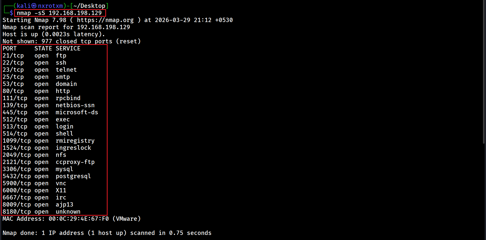

# 📘 Chapter 6: Service Enumeration & Exploitation Path

---

## 🔍 What is Enumeration?

**Enumeration** is the process of extracting **detailed information** from a target service.

- Unlike scanning (which finds ports), enumeration goes deeper.

---

### 🧠 Enumeration Answers Questions Like:

- ❓ What exactly is running?  
- 👤 Who are the users?  
- 💣 What vulnerabilities exist?  

---

## ⚔️ Scanning vs Enumeration

| Phase        | Purpose |
|-------------|--------|
| 🔍 Scanning  | Find open ports |
| 🧠 Enumeration | Extract detailed data |

---

# ⚙️ Lab Setup

## 🖥️ Attacker Machine

- Kali Linux
## 🎯 Target Machine
- Metasploitable2 IP (example): 192.168.198.129

---

# let's start enumaration and exploits

### To perform enumaration, first it's neccessery to find open port and services running on it.

### 🔹 Command 1 : Stealth Scan (SYN Scan) (Basic recon)

### 📌 Description:

- By running this command, all open ports and running services will be displayed as output.

### 📷 Output:

---

### 🎯 All open ports are listed above. The next step is to determine the versions of the associated services.

---

  ⚡ “Scanning shows the door. Enumeration finds the key.” ⚡

